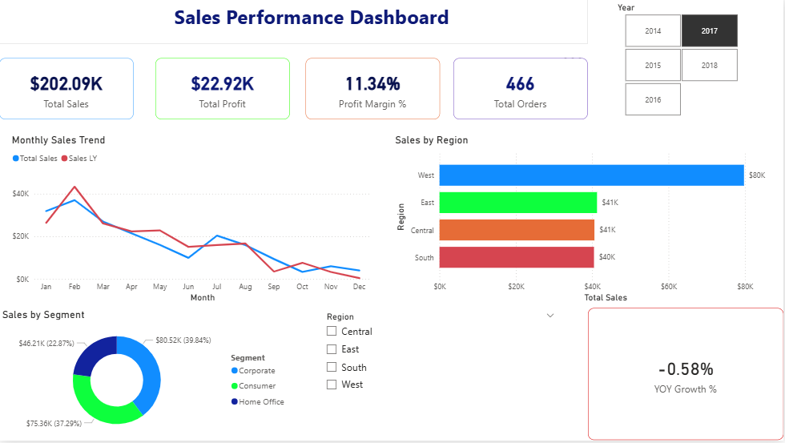
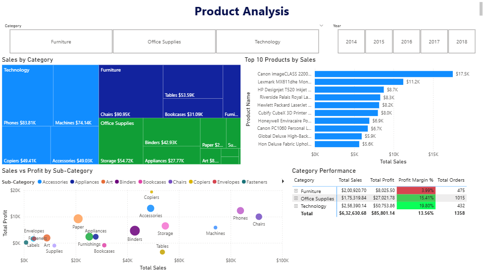
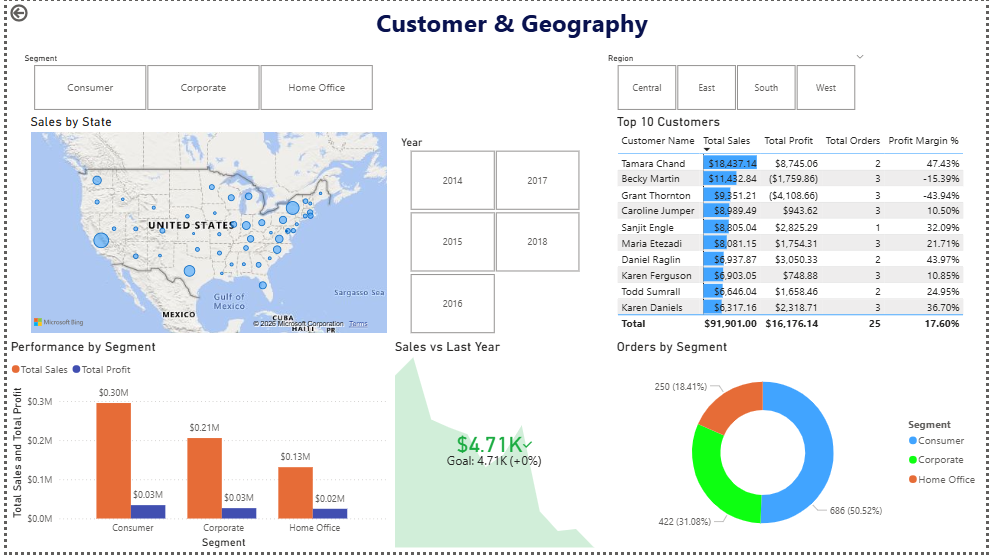

# Sales Performance Dashboard — Power BI

---

## Project Overview
An interactive 3-page Sales Performance Dashboard built using Power BI Desktop, analyzing sales data from the Sample Superstore dataset (9,994 rows). The dashboard provides insights into sales trends, product performance, customer behavior, and geographical distribution of sales across the US.

---

## Dashboard Preview

### Page 1 — Executive Overview

### Page 2 — Product Analysis

### Page 3 — Customer & Geography

---

## Tools & Technologies

| Tool | Purpose |
|---|---|
| Power BI Desktop | Dashboard development |
| DAX | Calculated measures |
| Power Query | Data cleaning & ETL |
| Microsoft Excel | Initial data exploration |

---

## Dataset

- **Source:** Sample Superstore Dataset (Kaggle)
- **Rows:** 9,994 orders
- **Columns:** 21 fields
- **Period:** 2014 — 2017
- **Link:** kaggle.com/datasets/vivek468/superstore-dataset-final

---

## Data Model

Star schema with 3 tables:

- **Sample - Superstore** (Fact Table) connects to:
  - Customers (Dimension)
  - Date Table (Dimension)
  - Products (Dimension)
- **_Measures** (DAX measures table)

---

## Power Query / ETL Steps

1. Fixed Order Date errors caused by DD-MM-YYYY vs MM-DD-YYYY format mismatch using locale-based conversion
2. Changed data types for all columns correctly
3. Created custom Profit Margin column
4. Extracted Year, Month, Quarter from Order Date
5. Trimmed and cleaned text columns
6. Removed blank rows

---

## DAX Measures Created

### Basic KPIs
| Measure | Formula Used |
|---|---|
| Total Sales | SUM(Sales) |
| Total Profit | SUM(Profit) |
| Total Orders | DISTINCTCOUNT(Order ID) |
| Total Quantity | SUM(Quantity) |
| Profit Margin % | DIVIDE(Total Profit, Total Sales) |
| Avg Order Value | DIVIDE(Total Sales, Total Orders) |
| Avg Discount | AVERAGE(Discount) |

### Time Intelligence
| Measure | Formula Used |
|---|---|
| Sales LY | CALCULATE + SAMEPERIODLASTYEAR |
| YOY Growth % | DIVIDE(Sales - Sales LY, Sales LY) |
| MTD Sales | CALCULATE + DATESMTD |
| YTD Sales | CALCULATE + DATESYTD |
| Profit LY | CALCULATE + SAMEPERIODLASTYEAR |
| YOY Profit Growth % | DIVIDE(Profit - Profit LY, Profit LY) |

### Ranking
| Measure | Formula Used |
|---|---|
| Product Rank | RANKX(ALL, Total Sales, DESC) |
| Customer Rank | RANKX(ALL, Total Sales, DESC) |

---

## Dashboard Pages

### Page 1 — Executive Overview
- 4 KPI Cards: Total Sales, Total Profit, Profit Margin %, Total Orders
- Line Chart: Monthly Sales Trend (vs Last Year)
- Bar Chart: Sales by Region
- Donut Chart: Sales by Segment
- Card: YOY Growth %
- Slicers: Year, Region

### Page 2 — Product Analysis
- Treemap: Sales by Category & Sub-Category
- Bar Chart: Top 10 Products by Sales
- Scatter Plot: Sales vs Profit by Sub-Category
- Matrix: Category Performance with conditional formatting
- Slicers: Category, Year

### Page 3 — Customer & Geography
- Map Visual: Sales by State
- Table: Top 10 Customers
- Column Chart: Performance by Segment
- KPI Visual: Sales vs Last Year
- Donut Chart: Orders by Segment
- Slicers: Segment, Region, Year

---

## Key Insights

1. **West region** has the highest sales at $725K
2. **Technology** category has the best profit margin at 19.80%
3. **Tables** sub-category has negative profit margin of -11.24% due to heavy discounting
4. **Consumer segment** accounts for 51.29% of total orders
5. **Q4** consistently shows highest sales across all years

---

## How to Use

1. Download the `.pbix` file from this repository
2. Open with Power BI Desktop (free download from microsoft.com)
3. Use slicers to filter by Year, Region, or Segment
4. Click any visual to cross-filter other visuals
5. Use navigation buttons to switch between pages

---

## Author

**Jatin Arora**
- LinkedIn:https://www.linkedin.com/in/jatin-arora-65b3a3326/?skipRedirect=true
- GitHub:https://github.com/Jatin2491
---

